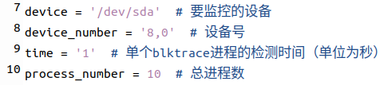
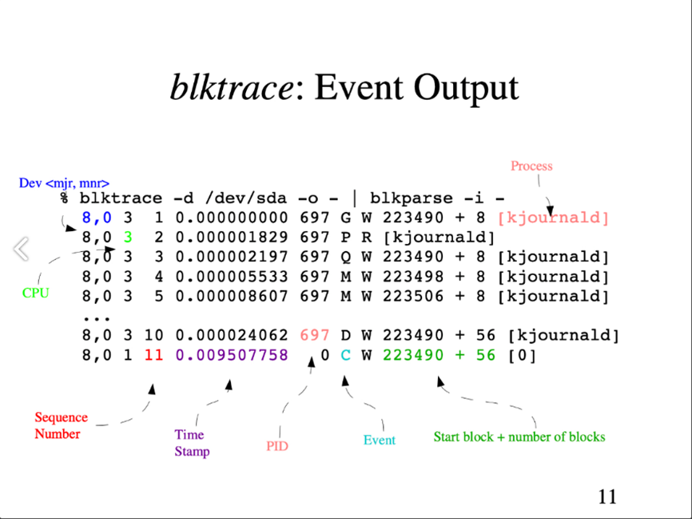

# 数据收集脚本使用说明（2024.11.8）

## 使用环境

Python3.0及以上

Linux系统

需提前安装blktrace工具


## 使用方法

命令行输入：sudo python3 {文件名}.py


## 脚本运行顺序

首先运行DataCollect.py进行数据收集，如果有需要运行的勒索程序，请在DataCollect.py运行期间通过PIDtest.py启动勒索程序，并记录其对应进程号。

DataCollect.py执行完成后，先运行DataManage.py处理数据，待其执行完毕后运行label.py对数据打上标签（记得修改其中的进程号列表）。最后，记得保存数据并修改文件名为数据收集时对应的运行情况。


## 文件命名格式

{勒索病毒种类（没有就填“无病毒”）}-{其他运行情况（如压缩，下载等，没有就填“无运行情况”）}-{收集时长（单位为秒）}.txt

如果某项有多个值，中间用“+”连接。

如果出现重名的文件，直接在文件名后加上-n即可。

例如：

GonnaCry-无运行情况-180.txt

BianLian+GonnaCry-解压缩-180.txt

无病毒-下载+看视频-120.txt

无病毒-下载+看视频-120-1.txt


## DataCollect.py

若看到“收集完成，总耗时：……”，则说明程序结束。

#### 相关参数（可自行修改）



注意，在修改了time变量的值后，需要同步修改DataManage.py中的process_time变量。

#### 基本原理

脚本采用异步编程的方式，主线程每隔time秒开启一个blktrace进程，收集到数据后开启异步任务（与主线程并行进行），同时开启下一个blktrace进程，进程总数为process_number。

在异步任务中，脚本会对blktrace返回的数据进行筛选，取出其中读写操作的对应行；对于每条写操作，脚本会根据其对应的写入区域，取出其在硬盘中对应的页面内容，并按序保存在二进制文件中。

#### 数据格式

1、这个脚本会生成一个data文件夹，里面的testn.txt和testn.bin分别对应第n个blktrace进程收集到的读写操作信息和写操作对应页面内容。此外，脚本还会在终端打印时间信息（即各节点相对于程序开始时的时间），可据此来判断数据空窗期的大小以及其产生的位置。

2、testn.txt格式（与blktrace相同）：



从左至右分别为：设备号，CPU号，序列号，时间戳，进程号，I/O事件（代表 I/O 请求进行到了哪一阶段），操作类型（R 表示 Read， W 是 Write，D 表示 block，B 表示 Barrier Operation），起始扇区号+扇区数（还有一种形式是“起始扇区号~结束扇区号”），进程名。

3、testn.bin格式：

按收集到的写操作的顺序存储，未剔除被后续写操作覆写的情况。


## PIDtest.py

该脚本用于跟踪勒索程序的主进程和子进程的进程号，需要手动将脚本中的whole_command变量替换为运行勒索程序的指令（注意勒索程序的相对路径）。

运行该脚本后，脚本会执行该指令（即在收集数据时，需通过该脚本执行勒索程序而非直接手动执行），并打印勒索程序主进程的进程号。在勒索程序运行时，脚本每隔0.5秒（时间间隔可调）打印一次当前存在的子进程的进程号。在勒索程序结束后，程序会输出“Finished!”，并打印出主进程的进程号和收集到的所有子进程的进程号。


## DataManage.py

该脚本用于处理DataCollect.py收集到的数据（默认相对路径：“./data”），它会总结文件夹下所有文件的内容，修正每条数据的时间戳，并在原数据后**按顺序**添加以下计算得到的字段（值为-1.0表示无法获取或计算）：

```
OWIO = 0  # 时间片内写入强度
OWST = 0  # 时间片写入强度之比
WAR = 0  # 是否读后写
APE = 0  # 平均页面熵
```

直接运行该脚本会在运行目录下生成一个不含标签的数据文件（data.txt）。由于每次运行该脚本都会清空data.txt，请在数据处理完成后及时保存。

此外，需要注意的是，process_time变量的值和DataCollect.py中的time变量保持一致。


## label.py

该脚本会根据PIDtest.py得到的进程号将数据打上标签（默认input：“data.txt”，默认output：“data_with_label.txt”），该标签为每行的最后一个字段，0表示非勒索操作，1表示勒索操作。

请注意，脚本中的进程号列表需手动添加，元素的数据类型为**字符串**。同时请在脚本执行完毕后及时保存数据。

